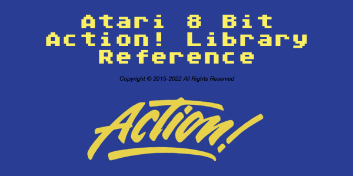

# A8 Action! Window Library
Atari 8 Bit Text Mode Windowing Library written in Action!

This is a text mode windowing library complete with window controls and modern gadgets (widgets).  The gadgets allow you to build input forms that use buttons, radio buttons, input strings (with scrolled lengths and type restrictions), check boxes, progress bars, etc.  This allows you to build applications with "modern"-ish interfaces.  

The windowing system preserves the contents under a window, but is not z-order based (by design).  It is up to you to open and close windows in the correct order.  Complete sample programs are included, as well as full API documentation.

License: GNU General Public License v3.0

See the LICENSE file for full license information.
